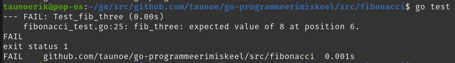
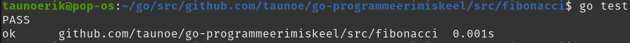
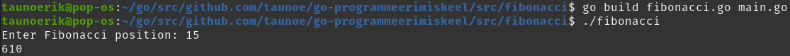

# Fibonacci sequence

We pass an integer N to a function and get the number in the fibonacci sequence at the demanded position.

    fibonacci(6) // output 8 (0, 1, 1, 2, 3, 5, 8)

## Test

    go test

## Run

    go run fibonacci.go main.go

## Build

    go build fibonacci.go main.go

    ./fibonacci

___

Copyright Tauno Erik 2021 [taunoerik.art](https://taunoerik.art/)
